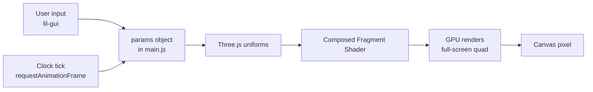
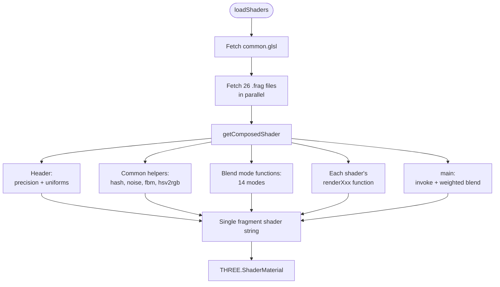
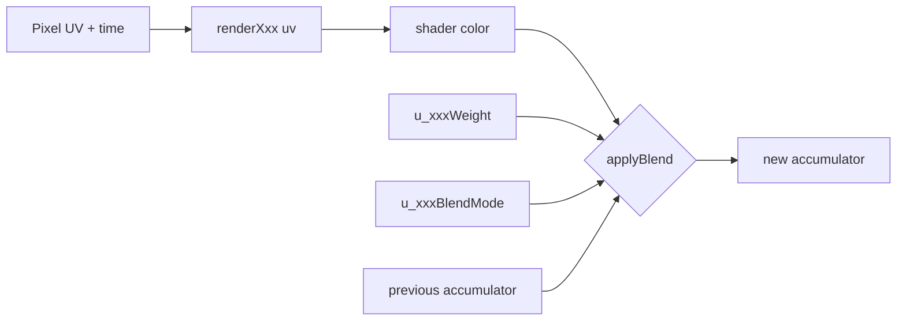
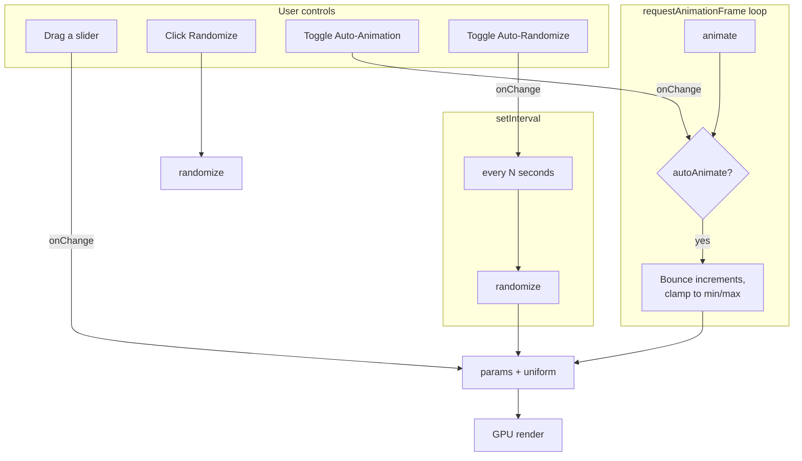

# InfiniBlend - Generative Shader Blender

A real-time generative art application that blends multiple shader algorithms through an intuitive GUI interface.

## Video 

 [](https://www.youtube.com/watch?v=JjrrPHfNPoM)

## Live Demo

[View InfiniBlend Live App](https://infiniblend-production.up.railway.app/)


## Features

- **26 Generative Algorithms**:
  - FBM (Fractal Brownian Motion) noise layers
  - Voronoi diagrams with animated cells
  - Reaction-Diffusion (Gray-Scott model)
  - Cellular Automata (Conway's Game of Life variant)
  - Kaleidoscopic transformations
  - Julia set fractals with animated parameters
  - Curl-noise flow field with drifting dye
  - Distance-field metaballs (soft blobs merging)
  - Animated superformula shapes morphing over time
  - Truchet tile patterns with rotation randomness
  - Classic sine-based plasma with palette cycling
  - Moiré interference rings & grids
  - Phyllotactic spiral particles (golden-angle)
  - Diffusion-Limited Aggregation growth simulation
  - Distance-estimator Mandelbrot zoom
  - Lloyd-relaxed hex tiling morphing
  - Aurora Borealis curtains
  - Spirograph / hypotrochoid curves
  - Nebula gas clouds
  - Lissajous curve patterns
  - Warp tunnel
  - Caustics (water-light refraction)
  - Galaxy spiral arms with stars
  - Electric field visualization
  - Stained glass mosaic
  - Topographic contour map
- **Interactive Controls**:
  - Per-shader enable toggle, blend weight (0-1), and blend mode selector
  - 14 blend modes per shader (Normal, Multiply, Screen, Overlay, Soft/Hard/Linear/Vivid Light, Color Dodge/Burn, Difference, Exclusion, Lighten, Darken)
  - Algorithm-specific parameter sliders
  - Global adjustments (time scale, brightness, contrast, saturation)
  - Auto-Animation with adjustable speed — parameters drift and bounce within their bounds
  - Auto-Randomize with configurable interval (1-20 sec) — re-randomizes the scene automatically
  - Randomize button with tuned value ranges for pleasing results
  - 6 built-in presets
  - Save parameters to JSON

## Running Locally

### Prerequisites

- Node.js (version 18 or higher)
- npm (comes with Node.js)

### Quick Start

1. **Clone the repository**:

   ```bash
   git clone https://github.com/GregP-Navdna/InfiniBlend.git
   cd InfiniBlend
   ```

2. **Install dependencies**:

   ```bash
   npm install
   ```

3. **Start the development server**:

   ```bash
   npm start
   ```

4. **Open in browser**:
   - Navigate to [http://localhost:3000](http://localhost:3000)
   - The server will log the URL in the console

### Alternative: Simple HTTP Server

If you prefer not to use Node.js, you can still run with a simple HTTP server:

```bash
# Python 3
python -m http.server 8000

# Or using Node.js http-server
npx http-server -p 8000
```

## Railway Deployment

This project is configured for easy deployment on Railway.app:

1. **Prerequisites**:
   - A Railway account (sign up at [railway.app](https://railway.app))
   - Git installed on your machine

2. **Deploy to Railway**:

   ```bash
   # Install dependencies locally first
   npm install
   
   # Initialize git if not already done
   git init
   git add .
   git commit -m "Initial commit"
   
   # Deploy using Railway CLI
   npm install -g @railway/cli
   railway login
   railway link
   railway up
   ```

3. **Alternative: Deploy via GitHub**:
   - Push your code to a GitHub repository
   - Connect your GitHub account to Railway
   - Create a new project and select your repository
   - Railway will automatically detect the configuration and deploy

4. **Configuration**:
   - The project uses Node.js with Express to serve static files
   - Port is automatically configured via `process.env.PORT`
   - All necessary Railway configuration is included in `railway.json`

## Controls

The interface uses two independent panels.

### Shader Controls (left panel — starts collapsed)

- One folder per algorithm (26 total), collapsed by default so the full list is visible at a glance
- Expand a folder to see:
  - **Enabled** toggle — turn the shader on/off
  - **Weight** slider (0-1) — how much this shader contributes to the final blend
  - **Blend Mode** dropdown — one of 14 compositing modes
  - **Algorithm-specific parameters** — scale, speed, iteration count, color shift, etc.

### Global & Utils (right panel)

- **Quick Controls** (top):
  - Randomize button
  - Auto-Animation On/Off + Speed slider
  - Auto-Randomize On/Off + Interval slider (1-20 sec)
- **Utils** (collapsed by default):
  - Preset 1-6 buttons
  - Save JSON — exports the current parameter set
- **Global**:
  - Time Scale, Brightness, Contrast, Saturation
- **GitHub link** at the bottom

### Boot Behavior

The app starts with Auto-Animation and Auto-Randomize both enabled, and immediately triggers a Randomize so you land on a fresh scene that evolves on its own.

## Presets

The application includes 6 carefully crafted presets:

1. **Dreamy Flow**: Soft FBM noise blended with flowing Voronoi cells
2. **Kaleidoscope Dreams**: Hypnotic kaleidoscopic patterns with subtle noise
3. **Fractal Reaction**: Julia set fractals mixed with reaction-diffusion patterns
4. **Flowing Metaballs**: Curl-noise flow fields with organic metaball shapes
5. **Geometric Patterns**: Superformula shapes combined with Truchet tiles and Moiré patterns
6. **Cosmic Fractals**: Plasma effects, phyllotactic spirals, and Mandelbrot zoom

## How It Works

### High-Level Render Pipeline

Every frame is one GPU draw of a full-screen quad. The fragment shader is a single large program, dynamically assembled at startup from 26 independent `.frag` files plus shared utilities. Each shader contributes a color; those colors are combined through weighted blending using per-shader blend modes.



### Shader Composition (boot time)

`ShaderComposer` fetches each `.frag` file, then concatenates them into one fragment shader with shared header (uniforms + common helpers), per-shader functions, and a final `main()` that invokes and blends them.



### Per-Shader Blend Model

For each active shader, the composed `main()` does roughly:

```glsl
if (u_xxxEnabled > 0.5) {
    vec3 c = renderXxx(uv);
    finalColor = applyBlend(finalColor, c, u_xxxBlendMode, u_xxxWeight);
}
```

This means the output depends on three per-shader uniforms plus the pixel-level algorithm:



Shaders are evaluated in a fixed order, so the blend mode of each shader acts on the accumulated color from all earlier shaders.

### Runtime Control Flow

Three independent systems feed into `params` during runtime: user GUI interaction, the auto-animation ticker (inside the render loop), and the auto-randomize timer (separate `setInterval`).



### Randomize Logic

`randomize()` treats parameters in three classes:

1. **Booleans** (per-shader `*Enabled`) — 50/50 coin flip
2. **Blend modes** (per-shader `*BlendMode`) — uniform integer pick from 14 options
3. **Numeric sliders** — uniform random in the controller's `[min, max]` range, except for a short override list that uses tuned ranges:

    | Param | Randomize range | Controller range |
    | --- | --- | --- |
    | `timeScale` | 0.5 – 5.0 | 0 – 5 |
    | `brightness` | 1.0 – 1.75 | 0 – 2 |
    | `contrast` | 0.8 – 1.5 | 0 – 2 |
    | `saturation` | 0.5 – 2.0 | 0 – 2 |
    | `autoAnimateSpeed` | 0.25 – 4.0 | 0 – 5 |

    `autoRandomizeInterval` is excluded from randomization so the user's chosen cadence is preserved.

### Auto-Animate Details

When enabled, each animatable parameter gets a random per-parameter increment. Each frame the value drifts by `increment * deltaTime * 60 * autoAnimateSpeed`. When it hits the slider's min or max it reverses direction (bounce), so values stay inside each controller's range without snapping. Global color/blend-mode params, and the meta-toggles themselves, are excluded.

## Architecture

- **`src/main.js`**: Three.js setup, two-panel GUI construction, parameter and uniform bindings, randomize / auto-animate / auto-randomize logic, preset loader, animation loop
- **`src/shaderComposer.js`**: Loads every `.frag` file and composes them into a single fragment shader with all uniforms, blend-mode functions, and per-shader invocation + weighted blending
- **`src/guiConfig.js`**: Registers the algorithm-specific parameter sliders into the matching shader folders
- **`src/shaders/`**:
  - `common.glsl`: Shared utility functions (hash, noise, FBM, rotations, `hsv2rgb`, smooth min)
  - 26 individual `.frag` files, one per algorithm

## Performance

- Optimized for 60 FPS on mid-range GPUs
- Single-pass rendering with weighted blending
- Shared noise functions to reduce computation

## Browser Compatibility

- Chrome (recommended)
- Firefox
- Safari (desktop)

## Algorithm Credits

- Perlin/Simplex noise: Ken Perlin
- Voronoi diagrams: Georgy Voronoi
- Reaction-Diffusion: Alan Turing, Gray-Scott model
- Cellular Automata: John Conway
- Fractal algorithms: Benoit Mandelbrot, Gaston Julia

## License

MIT License - Feel free to use and modify for your projects!
